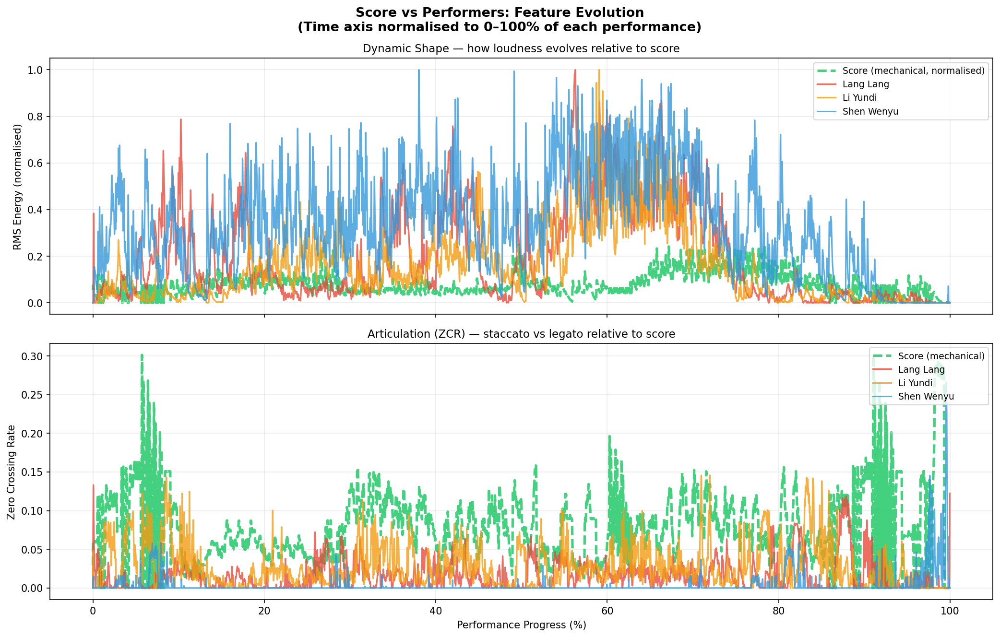
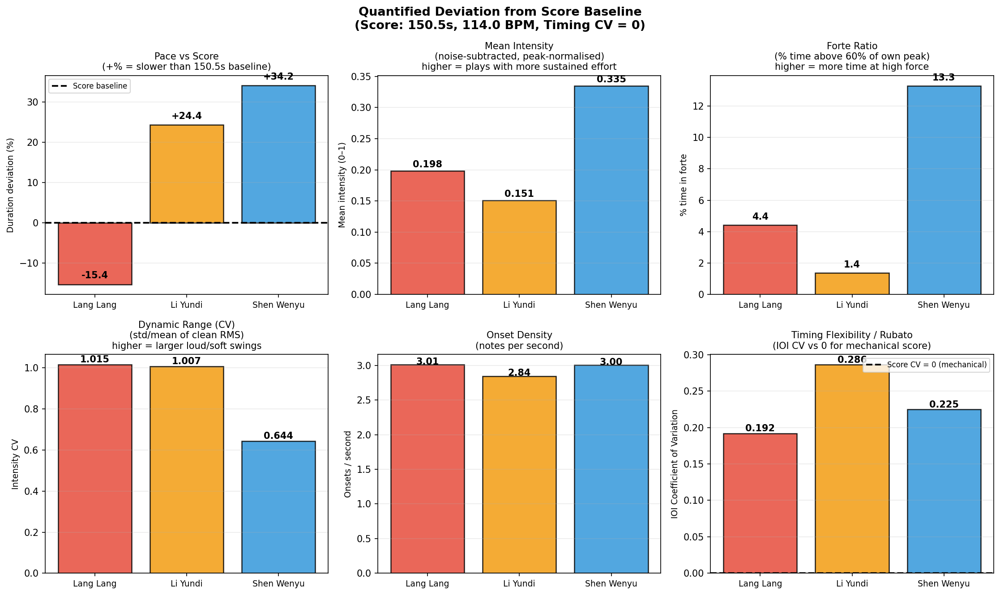

# Piano Performance Style Analysis

A comprehensive music information retrieval (MIR) research project comparing the expressive performance styles of three renowned Chinese pianists performing 彩云追月 (Colorful Clouds Chasing the Moon, Wang Jianzhong 1975 piano arrangement).

## Overview

This project analyzes and compares the musical characteristics of three pianists:
- **郎朗** (Lang Lang)
- **李云迪** (Li Yundi)
- **沈文裕** (Shen Wenyu)

Through multi-dimensional audio feature analysis using standard MIR techniques, anchored by a **mechanical score baseline** derived from the actual printed sheet music.

## Key Features

- **Score Baseline Comparison**: Performer deviations measured against the Wang Jianzhong MIDI (114 BPM) as mechanical ground truth
- **Device-Independent Amplitude Analysis**: Two-step debiasing removes recording noise and gain differences to enable fair cross-recording dynamics comparison
- **9-Dimensional Expressive Analysis**: Timing, Dynamics, Articulation, Vibrato, Tone Color, Attack, Sustain, Rubato, and Agogic Accents
- **Advanced Statistical Analysis**: ANOVA with Bonferroni correction (α = 0.05/13 = 0.0038), Tukey HSD post-hoc tests, effect size calculations (Cohen's d, eta-squared)
- **Machine Learning**: SVM classification with permutation-based feature importance; K-means clustering
- **Temporal Analysis**: 2-second windowed feature extraction and temporal self-consistency metrics
- **Comprehensive Visualizations**: Radar charts, clustering dendrograms, temporal curves, score deviation bar charts

## Audio Preprocessing

To ensure fair comparison, all audio files are processed through:
- **Sample Rate**: 22,050 Hz (uniform resampling)
- **Leading Silence Removed**: Onset-aligned audio content (Shen Wenyu's home recording had 7.4s of pre-music noise trimmed)
- **Noise-Subtracted, Peak-Normalized RMS**: For cross-recording dynamics comparison, each recording's noise floor (5th-percentile RMS) is subtracted, then peak-normalized to 1.0 — removing both microphone noise bias and recording gain differences while preserving genuine dynamic effort

See `audio_normalization.py` for the normalization pipeline. Normalized audio files are stored in `normalized_audio/`.

### Preprocessing Results
| Pianist | Recording Type | Duration | Notes |
|---------|---------------|----------|-------|
| Lang Lang | Studio | 127.4s | — |
| Li Yundi | Studio | 187.2s | — |
| Shen Wenyu | Home recording | 201.9s | 7.4s pre-music noise trimmed |

## Score Baseline

The Wang Jianzhong arrangement MIDI (`cai-yun-zhui-yue-ren-guang-qu-wang-jian-zhong-gai-bian.mid`) was obtained via optical music recognition (OMR) from the printed score PDF. Key properties:
- **BPM**: 114 (set_tempo from MIDI metadata)
- **Duration**: 150.5 seconds (mechanical playback)
- **Timing CV**: 0.0 (by definition — MIDI is perfectly metronomic)

`synthesize_reference.py` converts the MIDI to `reference_score.wav` using additive sine-wave synthesis (fundamental + 4 harmonics, exponential decay envelope).

## Project Structure

```
Sound project/
├── README.md
├── .gitignore
├── 62a57402e5a6c.pdf                                    # Official score (Wang Jianzhong 1975)
├── cai-yun-zhui-yue-ren-guang-qu-wang-jian-zhong-gai-bian.mid  # Real MIDI from OMR
│
├── SCORE COMPARISON
├── score_vs_performers.py                               # Score vs performers analysis (main)
├── synthesize_reference.py                              # MIDI → WAV synthesis
│
├── ANALYSIS PIPELINES
├── ultimate_pipeline.py                                 # Comprehensive statistical analysis
├── enhanced_pipeline.py                                 # Extended feature extraction (15+ dimensions)
├── expressive_style_pipeline.py                         # 9-dimensional expressive style analysis
├── music_analysis_pipeline.py                           # Initial analysis pipeline
│
├── AUDIO NORMALIZATION
├── audio_normalization.py                               # Normalize audio files
├── comparative_analysis_normalized.py                   # Fair comparison of normalized audio
├── normalized_audio/                                    # Standardized audio files (WAV, git-ignored)
│   ├── normalized_langlang_caiyun.wav
│   ├── normalized_liyundi_caiyun.wav
│   └── normalized_shenwenyu_caiyun.wav
│
├── UTILITIES
├── convert_audio.py                                     # Audio format conversion
├── verify_audio.py                                      # Audio verification
│
├── RESULTS
├── results_ultimate/
│   ├── plots/
│   │   ├── 05_temporal_evolution.png
│   │   ├── 06_clustering_visualization.png
│   │   ├── 07_effect_size_heatmap.png
│   │   ├── 08_hierarchical_dendrogram.png
│   │   ├── 11_temporal_vs_standard.png
│   │   ├── 12_score_vs_performers_curves.png            # RMS & ZCR time-series
│   │   └── 13_score_deviation_bars.png                  # Score deviation bar chart
│   ├── score_vs_performers.csv                          # Key metrics table
│   ├── tukey_posthoc_results.csv
│   ├── temporal_analysis.csv
│   ├── style_consistency.csv
│   └── ULTIMATE_ANALYSIS_REPORT.txt
│
├── results_enhanced/
│   ├── plots/
│   │   ├── 01_kfold_cv.png
│   │   ├── 02_anova_significance.png
│   │   ├── 03_train_vs_test.png
│   │   └── 04_feature_heatmap.png
│   └── feature_statistics.csv
│
├── results_expressive_style/
│   ├── plots/
│   │   ├── 09_expressive_style_radar.png
│   │   └── 10_dimensions_comparison.png
│   ├── expressive_style_9dimensions.csv
│   └── EXPRESSIVE_STYLE_REPORT.txt
│
└── results/                                             # Initial analysis
    ├── plots/ (01–07)
    ├── style_differences.csv
    ├── classification_accuracy.csv
    ├── confusion_matrix.csv
    └── analysis_report.txt
```

## Quick Start

### Requirements
```bash
pip install -r requirements.txt
```

### Score vs Performers Analysis (New)
```bash
# Generate reference WAV from the real MIDI
python synthesize_reference.py

# Run score baseline comparison
python score_vs_performers.py
```

### Full Analysis Pipelines
```bash
# Comprehensive statistical analysis
python ultimate_pipeline.py

# 9-dimensional expressive style
python expressive_style_pipeline.py

# Extended feature extraction + SVM
python enhanced_pipeline.py

# Initial MFCC/DTW analysis
python music_analysis_pipeline.py
```

## Key Findings

### Score vs Performers — Pace and Dynamics Comparison

Score baseline: **150.5 s, 114 BPM, Timing CV = 0.000** (mechanical)

| Pianist | Duration | Pace vs Score | MeanIntens | ForteRatio | DynCV | TimingCV |
|---------|----------|--------------|-----------|-----------|-------|----------|
| Lang Lang | 127.4s | **−15.4%** (fastest) | 0.198 | 4.4% | 1.015 | 0.192 |
| Li Yundi | 187.2s | +24.4% | 0.151 | 1.4% | 1.007 | **0.286** (most rubato) |
| Shen Wenyu | 201.9s | **+34.2%** (slowest) | **0.335** | **13.3%** | 0.644 | 0.225 |

*MeanIntens, ForteRatio, DynCV computed after noise-floor subtraction and peak-normalization — device-independent.*

**Pace**: Lang Lang plays 15% faster than score tempo; Shen Wenyu takes 34% longer.

**Dynamics (device-independent)**: After debiasing each recording against its own noise floor and peak, Shen Wenyu spends the most time in the upper dynamic range (ForteRatio 13.3% — frames exceeding 60% of peak), while Li Yundi plays most gently (1.4%). Lang Lang's "loud" impression correlates with his faster tempo and higher note density rather than sustained forte dynamics.

**Rubato**: Li Yundi shows the most timing flexibility (IOI CV = 0.286), nearly three times the score's mechanical zero. Lang Lang's faster tempo is achieved through uniformly shorter note values, not rubato compression.

### Expressive Character Profiles

**郎朗 (Lang Lang) — Driving and Energetic**
- Fastest tempo (127.4s — 15% faster than score, 37% faster than Shen Wenyu)
- Moderate dynamic effort (ForteRatio 4.4%), moderate timing flexibility (CV = 0.192)
- High onset density — the "energy" impression comes from pace and note density, not peak loudness

**李云迪 (Li Yundi) — Expressive and Flexible**
- Moderate pace (+24.4% from score), gentlest dynamics (ForteRatio 1.4%)
- Highest rubato (IOI CV = 0.286) — maximum artistic rhythmic freedom
- The "gentle" quality is real: consistently lighter dynamics with the most elastic phrasing

**沈文裕 (Shen Wenyu) — Deliberate and Full-Range**
- Slowest tempo (+34.2% from score), highest relative dynamic intensity (ForteRatio 13.3%)
- Moderate rubato (CV = 0.225), lowest DynCV (0.644) — steady high-intensity playing
- Despite quieter absolute recording level (home setup), the dynamic effort within his range is the greatest of the three

### MFCC / Timbral Classification

All 13 MFCC timbral dimensions differ significantly between performers (Bonferroni-corrected α = 0.0038). The SVM classifier achieves **99.98% training accuracy** on this 3-performer dataset. Temporal self-consistency (Pearson r > 0.98) confirms each performer maintains their character throughout the entire piece.

| Comparison | Significantly Different Dims | Avg Cohen's d | Effect |
|-----------|------------------------------|---------------|--------|
| Lang Lang vs Li Yundi | 12/39 | 0.158 | Small |
| Lang Lang vs Shen Wenyu | 13/39 | 0.593 | Medium |
| Li Yundi vs Shen Wenyu | 13/39 | 0.684 | Medium |

Shen Wenyu is acoustically most distinct from the other two.

## Technical Details

### Methodology Notes

**Why spectral centroid is excluded from cross-recording comparison**: Spectral centroid depends on the piano model, microphone placement, and recording chain — not solely on the performer's interpretation. It is not used in the score vs performers metrics.

**Device-independent dynamics**: The two-step debiasing (subtract noise floor, then peak-normalize) removes microphone-noise bias and recording-gain differences. What remains reflects relative dynamic effort within each recording — how much of their available dynamic range each performer actually uses.

**Score timing CV**: The MIDI baseline has CV = 0 by definition (mechanical playback). IOI-based BPM estimation on synthesized audio was discarded because onset detection on complex piano textures includes ornaments and inner voices, inflating apparent BPM above the actual score tempo.

**Bonferroni correction**: 13 simultaneous ANOVA tests on MFCC dimensions → family-wise error rate controlled at α = 0.05/13 = 0.0038.

**Agogic accent threshold**: IQR-based (Q3 + 0.5 × IQR) replacing an arbitrary 110% threshold, adapting to each performer's own IOI distribution.

**Vibrato model**: For piano, vibrato is modeled as amplitude modulation (RMS envelope periodicity), not frequency modulation.

**DTW normalization**: DTW distances normalized by path length for fair comparison across recordings of different durations.

### Audio Features Extracted
- **MFCC** (Mel-Frequency Cepstral Coefficients): 13 dimensions
- **RMS Envelope**: Noise-subtracted, peak-normalized for cross-recording dynamics
- **Zero Crossing Rate**: Noise-floor-corrected, used as articulation proxy
- **Onset Detection**: Inter-onset intervals → timing CV (rubato), onset density
- **Expressive Dimensions**: Rubato, Vibrato (AM), Attack, Sustain, Agogic Accents

### Statistical Methods
- One-way ANOVA with Bonferroni correction (α = 0.05/13 = 0.0038)
- Tukey HSD post-hoc pairwise comparisons
- Effect size metrics (eta-squared η², Cohen's d)
- K-fold cross-validation (5-fold stratified)
- Permutation-based feature importance (SVM)
- Hierarchical clustering + K-means

## Visualizations

### Score vs Performers

#### Time-Series Comparison


Normalized RMS envelope and ZCR curves for each performer alongside the score reference. Shows dynamic shape and articulation density across the full performance.

#### Score Deviation Bar Chart


Bar chart showing each performer's deviation from the score baseline across pace, dynamics, and timing dimensions.

### Expressive Style


Polar radar charts showing the 9-dimensional expressive profile of each pianist, normalized 0–1 for fair comparison.


3×3 grid comparing all three pianists across nine dimensions.

### Statistical Analysis


Eta-squared effect sizes (η²) for all 13 MFCC dimensions. MFCC2 shows maximum effect (η² = 0.4763).


Hierarchical clustering dendrogram of MFCC features.


K-means clustering (k=3) of temporal frames showing acoustic distinctiveness.


Time-series RMS energy showing dynamic evolution throughout each performance.

### Classification


5-fold cross-validation results. High within-dataset accuracy confirms acoustically distinct fingerprints.


p-values for all extracted features under ANOVA.

## Conclusions

### Perceptual-Acoustic Correspondence

This study bridges **subjective listening perception** with **objective acoustic measurement**. Three distinct performance characters emerge consistently across all analysis methods:

**郎朗 (Lang Lang) — Driving and Energetic**: Fastest tempo at 15% above score, moderate dynamic effort. The "powerful" impression comes from pace and note density rather than sustained forte playing.

**李云迪 (Li Yundi) — Lyrical and Expressive**: Most rhythmic freedom (IOI CV = 0.286 — nearly 3× Lang Lang's), lightest dynamics. The most elastic, "breathing" phrasing of the three.

**沈文裕 (Shen Wenyu) — Deliberate and Full-Range**: 34% slower than score, highest relative dynamic intensity (ForteRatio 13.3%), most sustained high-energy playing despite a quieter home recording setup.

### Research Value

This framework demonstrates that acoustic features can **quantify what listeners intuitively perceive**, enabling:

- **Music education**: Express "play with more flexibility" as a concrete target (e.g., raise timing CV toward Li Yundi's 0.286)
- **Performance scholarship**: Provide objective evidence alongside critical interpretation, making style claims reproducible
- **Musicology**: Systematically compare how performers interpret the same work

### Limitations

- Only one piece per performer is available; temporal self-consistency measures within a single recording, not cross-piece generalization
- Recording conditions differ (studio vs home); the noise-subtraction debiasing mitigates but does not fully eliminate equipment effects
- Acoustic features capture *what* is happening acoustically but not *why* — differences in dynamics or timing may reflect technique, instrument, musical philosophy, or score edition

## License

MIT License

## Author

Wenli

## Acknowledgments

- Performances by Lang Lang, Li Yundi, and Shen Wenyu
- Wang Jianzhong piano arrangement (1975)
- librosa for audio feature extraction
- scikit-learn for machine learning
- scipy for statistical analysis
