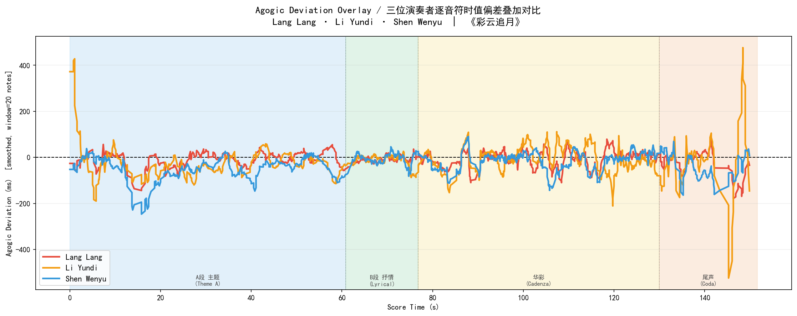

# Piano Performance Style Analysis

A music information retrieval (MIR) project comparing the expressive performance styles of three renowned Chinese pianists performing 彩云追月 (Colorful Clouds Chasing the Moon, Wang Jianzhong 1975 piano arrangement).

## Performers

- **郎朗** (Lang Lang) — Live stage performance, 127.4 s
- **李云迪** (Li Yundi) — Studio recording, 187.2 s
- **沈文裕** (Shen Wenyu) — Home recording, 201.9 s

## Analysis Overview

All analyses are anchored to a **mechanical score baseline** derived from the Wang Jianzhong MIDI (114 BPM). Four layers of analysis are stacked from coarse to fine:

| Layer | Script | What it measures |
|-------|--------|-----------------|
| Global comparison | `score_vs_performers.py` | Tempo, dynamics, rubato vs. score |
| Statistical classification | `ultimate_pipeline.py`, `enhanced_pipeline.py` | MFCC timbral distinctiveness |
| Section-by-section | `section_analysis.py` | Per-section dynamics and timing within each performer |
| Note-level alignment | `note_alignment.py` | Per-note agogic deviation (ms) relative to expected beat |
| Dynamics paradox | `dynamics_paradox.py` | Device-independent amplitude methodology demonstration |

---

## Audio Preprocessing

All recordings are processed through a two-step device-independent normalization before any cross-recording comparison:

1. **Noise floor subtraction**: 5th-percentile RMS frame is treated as the recording noise floor and subtracted from every frame
2. **Peak normalization**: Residual RMS is scaled so the maximum equals 1.0

This removes microphone noise bias and recording gain differences, so dynamic comparisons reflect genuine musical effort rather than equipment.

| Pianist | Recording Type | Duration | Notes |
|---------|---------------|----------|-------|
| Lang Lang | Live stage performance | 127.4 s | No pre-music silence |
| Li Yundi | Studio | 187.2 s | — |
| Shen Wenyu | Home recording | 201.9 s | 7.4 s pre-music noise trimmed |

See `audio_normalization.py` for the pipeline. Normalized files are in `normalized_audio/`.

---

## Key Findings

### 1. Global Pace and Dynamics

Score baseline: **150.5 s, 114 BPM, Timing CV = 0.000** (mechanical).

| Pianist | Duration | Pace vs Score | ForteRatio | TimingCV |
|---------|----------|--------------|-----------|----------|
| Lang Lang | 127.4 s | **−15.4%** fastest | 4.4% | 0.192 |
| Li Yundi | 187.2 s | +24.4% | 1.4% | **0.286** most rubato |
| Shen Wenyu | 201.9 s | **+34.2%** slowest | **13.3%** | 0.225 |

*ForteRatio = fraction of frames where normalized RMS > 0.6 (device-independent).*

- **Lang Lang** plays 15% faster than written tempo; his "energetic" impression comes from pace and note density, not sustained forte volume.
- **Li Yundi** has the highest rhythmic freedom (IOI CV = 0.286, nearly 3× Lang Lang's) and consistently lightest dynamics.
- **Shen Wenyu** takes 34% longer than score, with the highest relative dynamic intensity despite a lower-volume home recording setup.

---

### 2. Section-by-Section Analysis

Section boundaries derived from MIDI structure: largest rest gap at 76.84 s (2.1 s pause), followed by a 3× jump in note density (华彩 cadenza onset).

| Section | Span (score) | Character |
|---------|-------------|-----------|
| A段 主题 | 0 – 60.8 s | Main theme |
| B段 抒情 | 60.8 – 76.8 s | Lyrical interlude |
| 华彩 | 76.8 – 130.0 s | Cadenza / virtuoso section |
| 尾声 | 130.0 – 151.6 s | Coda |

**ForteRatio by section (device-independent):**

| Section | Lang Lang | Li Yundi | Shen Wenyu |
|---------|-----------|----------|-----------|
| A段 主题 | 0.9% | 0.0% | 5.7% |
| B段 抒情 | 2.8% | 0.0% | 8.2% |
| **华彩** | **10.8%** | **3.9%** | **28.8%** |
| 尾声 | 0.0% | 0.0% | 0.0% |

**Key findings:**
- The **华彩 cadenza is where the three performers diverge most sharply**. Shen Wenyu's forte ratio (28.8%) is 7.4× Li Yundi's (3.9%) — dramatically different approaches to the same virtuoso passage.
- **Lang Lang's timing CV is locked near 0.17 across all four sections** — a remarkable metronome-like rhythmic stability that does not change with musical context.
- **Li Yundi's 尾声 is nearly silent** (ForteRatio ≈ 1.2%), fading to a whisper; Lang Lang's ending retains moderate energy (12.0%).

---

### 3. Note-Level Agogic Deviation

DTW alignment between MIDI score onsets (936 unique times) and audio-detected performer onsets, after normalizing both sequences to the same time axis (removing global tempo difference). Agogic deviation = actual performer onset − expected onset under uniform tempo (ms; negative = ahead of beat, positive = behind).

**Mean ± Std deviation (ms) per section:**

| Section | Lang Lang | Li Yundi | Shen Wenyu |
|---------|-----------|----------|-----------|
| A段 主题 | −9 ± 110 | −20 ± 164 | **−45** ± 124 |
| B段 抒情 | −5 ± **89** | −17 ± **89** | −6 ± 99 |
| 华彩 | −6 ± 109 | −6 ± 137 | −14 ± 107 |
| 尾声 | −30 ± 146 | −24 ± **470** | −38 ± 155 |

**Key findings:**
- **B段 (lyrical interlude) is the most metronomic section** for all three performers — smallest standard deviation (89–99 ms), suggesting the melody here is played more strictly in time.
- **Li Yundi's 尾声 has extreme tempo freedom** (std = 470 ms), confirming his ending is highly improvisatory and free.
- **All performers show a slight negative bias** (rushing ahead of expected beat) throughout, meaning none of the three plays mechanically behind the beat.
- **Shen Wenyu rushes most in the opening A段** (mean = −45 ms), suggesting an impulsive or forward-leaning approach to the theme.

---

### 4. Dynamics Paradox — Why Device-Independent Normalization Matters

| Pianist | Absolute Peak RMS | 华彩 ForteRatio (raw) | 华彩 ForteRatio (normalized) |
|---------|------------------|----------------------|------------------------------|
| Lang Lang | 0.165 | — | 10.8% |
| Li Yundi | **0.229** highest | — | 3.9% |
| Shen Wenyu | **0.120** lowest | — | **28.8%** |

At face value, Shen Wenyu's home recording is the quietest (peak RMS only 54% of Li Yundi's studio level). A naive loudness comparison would rank him last. After noise-subtracted peak-normalization, his 华彩 ForteRatio (28.8%) is the highest — 7.4× Li Yundi's (3.9%). His dynamic contrast is the most extreme of the three, regardless of recording setup.

---

### 5. MFCC Timbral Classification

All 13 MFCC timbral dimensions differ significantly between performers (Bonferroni-corrected α = 0.05/13 = 0.0038). Each performer maintains their acoustic fingerprint throughout the full piece (temporal self-consistency Pearson r > 0.98).

| Comparison | Significantly Different Dims | Avg Cohen's d |
|-----------|------------------------------|---------------|
| Lang Lang vs Li Yundi | 12/13 | 0.158 (small) |
| Lang Lang vs Shen Wenyu | 13/13 | 0.593 (medium) |
| Li Yundi vs Shen Wenyu | 13/13 | 0.684 (medium) |

Shen Wenyu is acoustically most distinct from the other two.

---

## Performer Character Profiles

**郎朗 (Lang Lang) — Driving and Consistent**
- Fastest tempo; rhythmic stability locked at CV ≈ 0.17 in every section
- Moderate dynamics (ForteRatio 4.4% global, 10.8% in 华彩)
- The "energetic" impression is from pace and note density, not peak volume

**李云迪 (Li Yundi) — Lyrical and Free**
- Highest rhythmic freedom (IOI CV = 0.286) and most elastic phrasing
- Lightest dynamics throughout; 华彩 ForteRatio only 3.9%
- Ending (尾声) is the most improvisatory of the three (std = 470 ms)

**沈文裕 (Shen Wenyu) — Deliberate and Contrasting**
- Slowest overall pace; rushes ahead most in the opening A段 (mean −45 ms)
- Most extreme dynamic range in the cadenza (华彩 ForteRatio 28.8%)
- Despite the quietest recording environment, his musical dynamic effort is the greatest

---

## Project Structure

```
Sound project/
├── README.md
├── .gitignore
├── requirements.txt
├── 62a57402e5a6c.pdf                        # Official score (Wang Jianzhong 1975)
├── cai-yun-zhui-yue-ren-guang-qu-...mid    # Real MIDI from OMR
│
├── SCORE REFERENCE
├── synthesize_reference.py                  # MIDI → WAV synthesis
├── reference_score.wav                      # Synthesized score (git-ignored)
│
├── MAIN ANALYSIS SCRIPTS
├── score_vs_performers.py                   # Global score vs performer comparison
├── section_analysis.py                      # Section-by-section (A段/B段/华彩/尾声)
├── note_alignment.py                        # Note-level agogic deviation via DTW
├── dynamics_paradox.py                      # Dynamics paradox visualization (Direction C)
├── ultimate_pipeline.py                     # MFCC / statistical classification
├── enhanced_pipeline.py                     # Extended feature extraction (15+ dims)
├── expressive_style_pipeline.py             # 9-dimensional expressive analysis
├── music_analysis_pipeline.py               # Initial MFCC/DTW analysis
│
├── AUDIO NORMALIZATION
├── audio_normalization.py                   # Normalize audio files
├── normalized_audio/                        # Processed audio (WAV, git-ignored)
│   ├── normalized_langlang_caiyun.wav
│   ├── normalized_liyundi_caiyun.wav
│   └── normalized_shenwenyu_caiyun.wav
│
├── RESULTS
├── results_ultimate/
│   ├── plots/
│   │   ├── 05_temporal_evolution.png
│   │   ├── 06_clustering_visualization.png
│   │   ├── 07_effect_size_heatmap.png
│   │   ├── 08_hierarchical_dendrogram.png
│   │   ├── 11_temporal_vs_standard.png
│   │   ├── 12_score_vs_performers_curves.png
│   │   ├── 13_score_deviation_bars.png
│   │   ├── 14_section_comparison.png        # Section ForteRatio grouped bar
│   │   ├── 15_section_profiles.png          # Radar charts per section
│   │   ├── 16_section_rubato_dynamics.png   # Timing CV + dynamics scatter
│   │   ├── 17_agogic_deviation.png          # Note-level deviation over time
│   │   ├── 18_agogic_overlay.png            # Three performers overlaid
│   │   ├── 19_agogic_boxplot.png            # Box plots per section
│   │   └── 20_dynamics_paradox.png          # Raw vs normalised dynamics
│   ├── note_alignment.csv
│   ├── section_analysis.csv
│   └── score_vs_performers.csv
│
├── results_enhanced/
│   └── plots/ (01–04)
│
└── results_expressive_style/
    └── plots/ (09–10)
```

---

## Quick Start

```bash
pip install -r requirements.txt

# Score baseline vs performers
python synthesize_reference.py
python score_vs_performers.py

# Section-by-section analysis
python section_analysis.py

# Note-level agogic deviation
python note_alignment.py

# Dynamics paradox visualization
python dynamics_paradox.py

# Statistical classification
python ultimate_pipeline.py
python enhanced_pipeline.py
```

---

## Selected Visualizations

### Dynamics Paradox


Raw RMS vs device-independent normalized RMS across sections. Shows why Shen Wenyu's home recording looks quietest but has the most extreme dynamic contrast.

### Note-Level Agogic Deviation


Per-note timing deviation (ms) from expected beat across the full piece, smoothed over 15 notes, coloured by section.



All three performers overlaid — B段 is the most metronomic; Li Yundi's 尾声 deviates most.

### Section Comparison


Side-by-side section dynamics and timing. 华彩 shows the widest divergence across performers.

### Score vs Performers


Normalized RMS and ZCR envelopes for all performers alongside the score reference.

---

## Methodology Notes

**Section boundaries**: Derived from MIDI structure (largest rest gap + note density jump) rather than manual annotation, making the segmentation reproducible.

**DTW alignment**: Score onset times (from MIDI) and performer onset times (from audio) are both normalized to the same time axis before DTW, removing global tempo differences. The warp path maps each score note to its closest performed onset, enabling per-note deviation computation.

**Device-independent dynamics**: Noise-subtracted peak-normalization removes both microphone noise bias and recording gain. Comparisons reflect dynamic effort within each recording's own range, not absolute SPL.

**Spectral centroid excluded**: Depends on piano model, mic placement, and recording chain — not solely on performer interpretation.

**Bonferroni correction**: 13 simultaneous ANOVA tests on MFCC → α = 0.05/13 = 0.0038.

---

## Conclusions

Three distinct and internally consistent performance styles emerge across all analysis layers:

**Lang Lang** plays the fastest tempo with near-perfect rhythmic regularity (timing CV ≈ 0.17 in every section). His expressive energy is conveyed through pace and note density rather than dynamic extremes.

**Li Yundi** has the most elastic phrasing (IOI CV = 0.286) and the lightest dynamics throughout. His 华彩 is restrained (ForteRatio 3.9%), and his ending fades to near-silence with high tempo freedom (std = 470 ms).

**Shen Wenyu** shows the widest dynamic range in the cadenza (华彩 ForteRatio 28.8%) — a finding invisible without device-independent normalization. He rushes ahead most in the opening, plays the most deliberately overall, and produces the most extreme forte–piano contrasts.

The 华彩 (cadenza) section is the strongest discriminant between the three styles, with ForteRatio differing by a factor of 7.4× between Li Yundi and Shen Wenyu. The B段 (lyrical interlude) is where all three converge most closely in timing regularity.

### Limitations

- Single piece per performer; findings characterise this recording, not the performers' complete artistic identity
- Recording conditions differ (studio vs home vs live); debiasing mitigates but cannot fully eliminate equipment effects
- Acoustic features capture *what* happens but not *why* — differences may reflect technique, instrument, musical philosophy, or score edition

---

## License

MIT License

## Author

Wenli

## Acknowledgments

- Performances by Lang Lang, Li Yundi, and Shen Wenyu
- Wang Jianzhong piano arrangement (1975)
- librosa · scikit-learn · scipy · fastdtw
