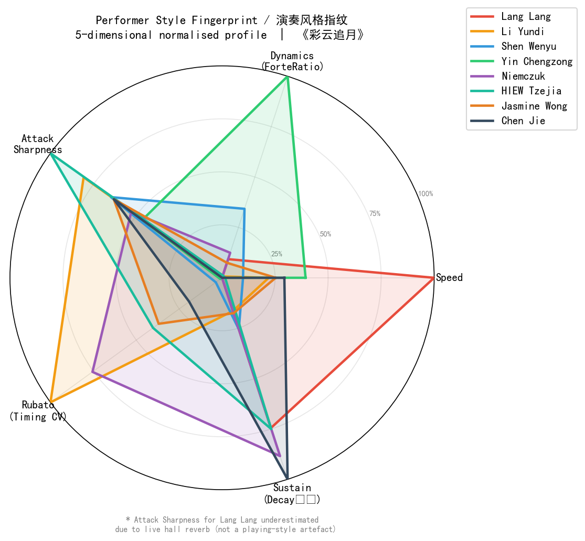
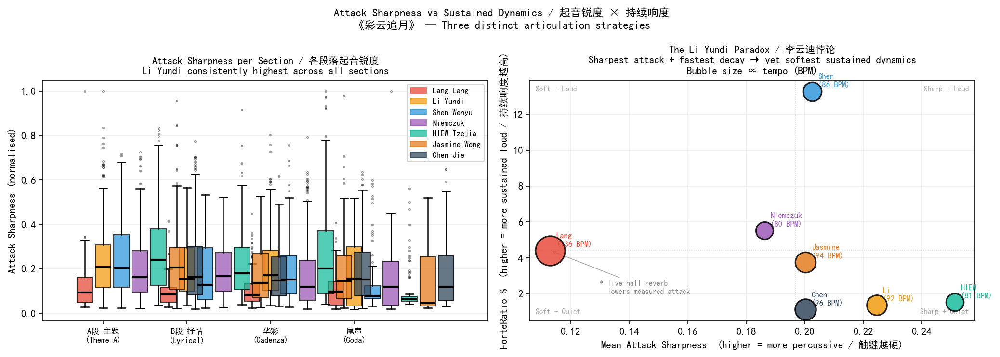
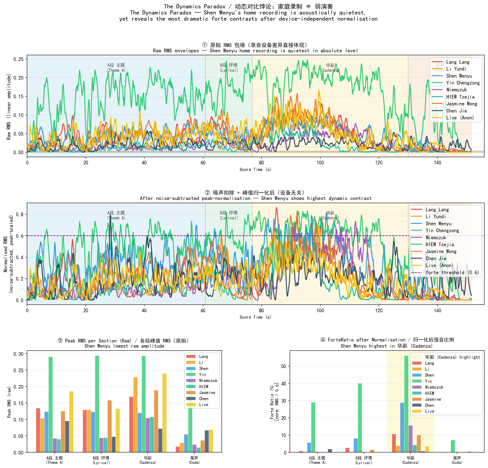
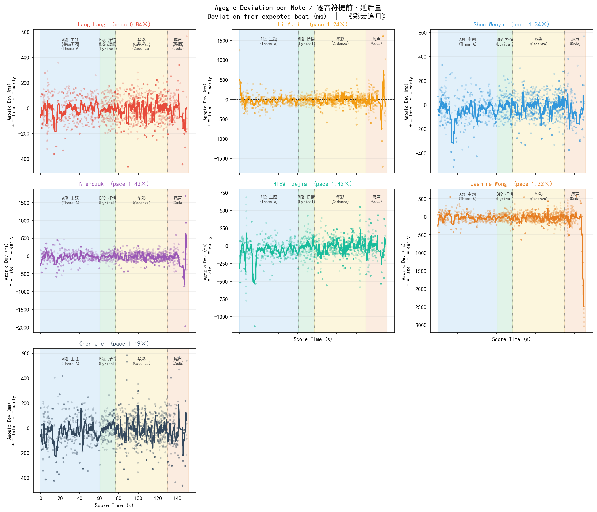
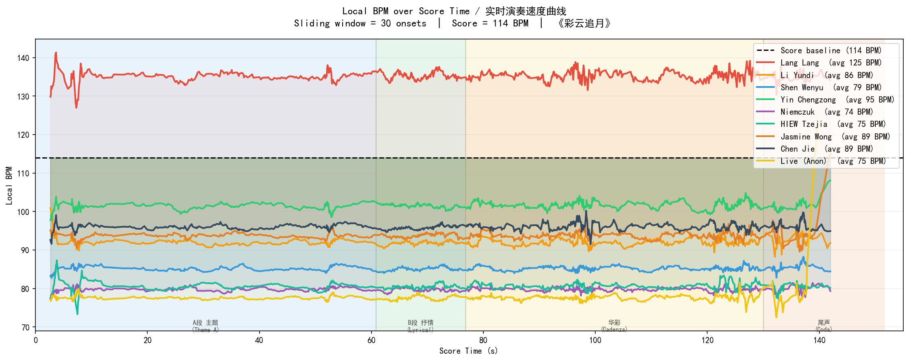
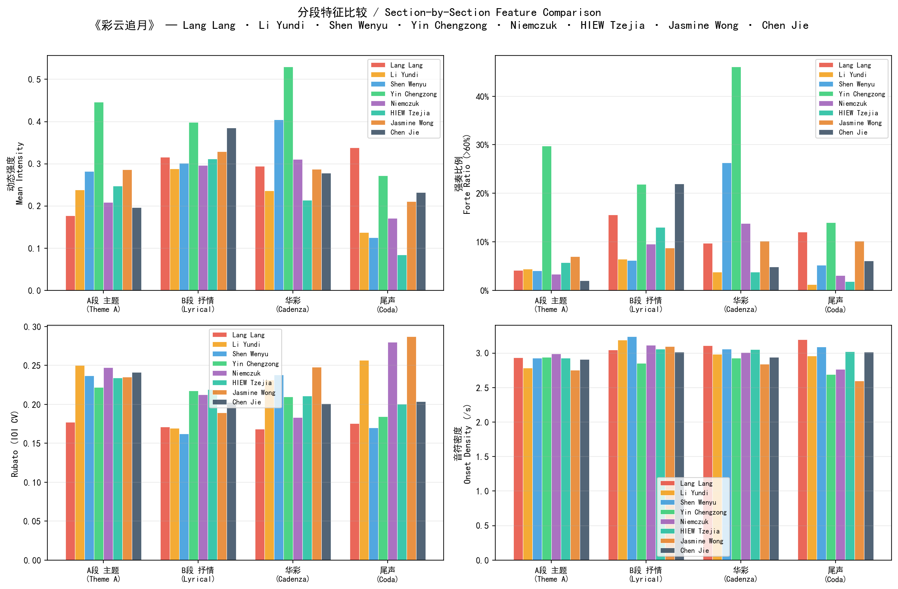

# Piano Performance Style Analysis
## Colorful Clouds Chasing the Moon · 《彩云追月》

A music information retrieval (MIR) project comparing the expressive performance styles of three renowned Chinese pianists — **Lang Lang**, **Li Yundi**, and **Shen Wenyu** — performing the Wang Jianzhong 1975 piano arrangement of 彩云追月.

---

## The Central Question

Three performers. One piece. Three radically different impressions:

> Lang Lang sounds **energetic and driving**.
> Li Yundi sounds **lyrical and expressive**.
> Shen Wenyu sounds **deliberate and intense**.

Which acoustic properties actually create these perceptions — and are our intuitions correct?

---

## Three Core Findings

### Finding 1 — The Lang Lang Effect: Speed, Not Volume

Lang Lang plays at **135 BPM** — 18% faster than the written score (114 BPM) and 60% faster than Shen Wenyu (85 BPM). His note density is the highest of the three.

But his sustained loudness (ForteRatio 4.4%) is moderate, and his measured attack sharpness is the lowest of the three. His "powerful" impression is generated almost entirely by **tempo and note density**, not by actually hitting the keys harder or louder.

| | BPM | ForteRatio | Attack Sharpness |
|--|-----|-----------|-----------------|
| Lang Lang | **135** | 4.4% | 0.113 † |
| Li Yundi | 92 | 1.4% | **0.225** |
| Shen Wenyu | 85 | **13.3%** | 0.203 |
| Score baseline | 114 | — | — |

*† Lang Lang's attack sharpness is underestimated due to live hall reverb smearing onsets.*

---

### Finding 2 — The Li Yundi Paradox: Precision Without Volume

Li Yundi has the **highest attack sharpness** (0.225) and the **fastest note decay rate** — meaning his individual notes are the most clearly defined and shortest-lasting of the three. He is the most articulate, most precise pianist in terms of touch.

Yet his sustained loudness is the **lowest** (ForteRatio 1.4%).

**Clarity ≠ Loudness.** Li Yundi deploys precise, well-articulated touches in service of a pianissimo dynamic palette. His "lyrical" quality is built from exact, controlled softness — not vague legato blurring.

This paradox is only visible when attack sharpness and sustained dynamics are measured separately.

---

### Finding 3 — The Shen Wenyu Paradox: Hidden Dynamic Range

Shen Wenyu's home recording has the **lowest absolute amplitude** (peak RMS = 0.120, vs Li Yundi's studio 0.227). A naive comparison would rank him as the softest performer.

After **noise-subtracted peak-normalisation** (removing recording gain differences):
- His overall ForteRatio (13.3%) is **3× Lang Lang's** (4.4%) and **9× Li Yundi's** (1.4%)
- In the **cadenza (华彩)** alone, his ForteRatio reaches **28.8%** — 7.4× Li Yundi's 3.9%

The dynamic contrast that defines his "intense" impression is real, but **invisible without device-independent measurement**.

---

### Unifying Observation — Macro Stability, Micro Freedom

Despite widely different styles, all three performers share one structural property: **tempo is constant across sections**.

| Section | Lang Lang | Li Yundi | Shen Wenyu |
|---------|-----------|----------|-----------|
| A段 主题 (Theme A) | 135 BPM | 92 BPM | 85 BPM |
| B段 抒情 (Lyrical) | 135 BPM | 92 BPM | 85 BPM |
| 华彩 (Cadenza) | 135 BPM | 92 BPM | 85 BPM |
| 尾声 (Coda) | 135 BPM | 92 BPM | 86 BPM |

None of the three uses section-level tempo changes as an expressive tool. Instead, all musical expression occurs at the **note level**: per-note agogic deviations of 60–470 ms relative to the expected beat, concentrated especially in the coda — 尾声 (Li Yundi std = 470 ms).

The **cadenza — 华彩** is the section of maximum divergence across all dimensions — ForteRatio differs by 7.4× between performers, making it the strongest single discriminant of style.

---

### Answering the Central Question

> *Which acoustic properties actually create these perceptions — and are our intuitions correct?*

Our intuitions are directionally right but mechanistically wrong in every case.

**Lang Lang does sound energetic** — but the source is tempo (135 BPM, 18% above score), not dynamics. His ForteRatio is moderate and his attack sharpness is the lowest of the three. The "powerful" impression is a perceptual effect of pace and note density, not of hitting harder.

**Li Yundi does sound lyrical** — but not because of blurred legato softness. He is actually the most precisely articulate performer (highest attack sharpness, fastest decay). His lyricism comes from deploying that precision at the softest dynamic level. Clarity, not vagueness, is his tool.

**Shen Wenyu does sound intense** — and this intuition is the most accurate. His dynamic contrast is genuinely the most extreme. But this is only verifiable through device-independent normalisation; a naive amplitude comparison would rank him last.

In short: perceived character maps to real acoustic structure, but the mechanism behind each impression is consistently counterintuitive.

---

## Performer Profiles

**郎朗 Lang Lang — The Velocity Architect**
- Fastest tempo (135 BPM, 18% above score); note density drives perceived energy
- Moderate dynamics (ForteRatio 4.4%); rhythm locked at CV ≈ 0.17 in every section
- "Energetic" impression is a tempo effect, not an amplitude effect

**李云迪 Li Yundi — The Articulate Whisperer**
- Sharpest attack (0.225) and fastest decay — most precisely defined note boundaries
- Softest sustained dynamics (1.4%); highest rhythmic freedom (Timing CV = 0.286)
- Coda (尾声) ending: near-silent with extreme temporal freedom (agogic std = 470 ms)

**沈文裕 Shen Wenyu — The Dynamic Extremist**
- Most extreme forte–piano contrast; cadenza (华彩) ForteRatio = 28.8% (7.4× Li Yundi)
- Home recording is the quietest in absolute terms — paradox invisible without normalisation
- Slowest tempo (85 BPM); rushes ahead most in opening theme (A段, agogic mean = −45 ms)

---

## Methodology

### Score Baseline

All analyses are anchored to the Wang Jianzhong MIDI (`cai-yun-zhui-yue-ren-guang-qu-wang-jian-zhong-gai-bian.mid`) at 114 BPM as mechanical ground truth.

### Device-Independent Dynamics

Two-step debiasing applied before any cross-recording amplitude comparison:
1. **Noise floor subtraction**: 5th-percentile RMS frame subtracted from every frame
2. **Peak normalisation**: residual scaled to max = 1.0

Removes microphone noise bias and recording gain differences. What remains is relative dynamic effort within each recording.

### Score Alignment (Note-Level)

936 unique MIDI onset times are extracted from the score. Performer onsets are detected via `librosa.peak_pick`. Both sequences are normalised to the same time axis (dividing by the pace ratio), then aligned with **fastdtw** on 1D onset time sequences (radius = 60). This computes per-note agogic deviation in milliseconds without audio-to-audio DTW, which fails across different recording environments.

### Attack Sharpness

Peak-normalised onset strength at each detected onset. Captures how suddenly each note's amplitude rises (percussive vs smooth attack). Note: live hall reverb attenuates measured onset sharpness for Lang Lang.

### Local BPM

Sliding window of 30 unique score onsets. For each window: `local_BPM = 114 × (delta_score / delta_perf)`. Mapped to score time for cross-performer alignment.

---

## Audio Preprocessing

| Pianist | Recording Type | Duration | Preprocessing |
|---------|---------------|----------|--------------|
| Lang Lang | Live stage performance | 127.4 s | Sample rate normalised |
| Li Yundi | Studio | 187.2 s | — |
| Shen Wenyu | Home recording | 201.9 s | 7.4 s pre-music noise trimmed |

---

## Project Structure

```
Sound project/
├── ANALYSIS SCRIPTS
├── score_vs_performers.py       # Global pace, dynamics, rubato vs score
├── section_analysis.py          # Per-section features (A段/B段/华彩/尾声)
├── note_alignment.py            # Note-level agogic deviation via DTW
├── tempo_analysis.py            # Local BPM curves from aligned onsets
├── attack_analysis.py           # Attack sharpness, decay rate, fingerprint
├── dynamics_paradox.py          # Shen Wenyu dynamics paradox visualisation
├── ultimate_pipeline.py         # MFCC statistical classification
├── enhanced_pipeline.py         # Extended feature extraction
├── expressive_style_pipeline.py # 9-dimensional expressive analysis
│
├── SCORE REFERENCE
├── synthesize_reference.py
├── cai-yun-zhui-yue-ren-guang-qu-...mid   # Real MIDI from OMR
│
├── AUDIO
├── audio_normalization.py
├── normalized_audio/            # Preprocessed WAVs (git-ignored)
│
└── results_ultimate/
    ├── plots/
    │   ├── 12_score_vs_performers_curves.png
    │   ├── 13_score_deviation_bars.png
    │   ├── 14_section_comparison.png      # Section ForteRatio grouped bar
    │   ├── 15_section_profiles.png        # Per-performer section radar grid
    │   ├── 16_section_rubato_dynamics.png # Timing CV + ForteRatio line plots
    │   ├── 17_agogic_deviation.png        # Per-note timing deviation curves
    │   ├── 18_agogic_overlay.png          # Three performers overlaid
    │   ├── 19_agogic_boxplot.png          # Box plots per section
    │   ├── 20_dynamics_paradox.png        # Raw vs normalised RMS
    │   ├── 21_local_bpm_curves.png        # Local BPM overlay
    │   ├── 22_local_bpm_subplots.png      # BPM per performer
    │   ├── 23_section_bpm_bars.png        # Section median BPM bars
    │   ├── 24_attack_sharpness_curves.png # Attack sharpness over time
    │   ├── 25_liyundi_paradox.png         # Attack × dynamics bubble chart
    │   ├── 26_decay_rate_bars.png         # Note decay rate per section
    │   └── 27_performer_fingerprint.png   # 5-dim radar fingerprint
    ├── note_alignment.csv
    ├── section_analysis.csv
    ├── attack_analysis.csv
    └── score_vs_performers.csv
```

---

## Key Visualisations

### Performer Fingerprint


Five-dimensional normalised radar: Speed, Dynamics, Attack Sharpness, Rubato, Sustain. The three performers occupy distinctly different regions.

### Li Yundi Paradox


Bubble chart: X = attack sharpness, Y = ForteRatio, bubble size = tempo. Li Yundi sits at top-left (sharp attack, soft dynamics). Lang Lang is bottom-left with the largest bubble (fast tempo as main differentiator).

### Dynamics Paradox


Raw vs device-independent RMS. Shen Wenyu is quietest in absolute level but shows highest dynamic contrast after normalisation.

### Note-Level Agogic Deviation


Per-note timing deviation from expected beat. The lyrical interlude (B段) is the most metronomic section; Li Yundi's coda (尾声) has extreme temporal freedom (std = 470 ms).

### Local BPM


All three performers maintain consistent tempo throughout the piece. Expression is at the note level, not the architectural level.

### Section Comparison


The cadenza (华彩) is the widest point of divergence across all metrics.

---

## Tech Stack

| Library | Version | Role |
|---------|---------|------|
| [librosa](https://librosa.org) | ≥ 0.10 | Audio loading, onset detection, MFCC, RMS, ZCR, onset strength |
| [fastdtw](https://github.com/slaypni/fastdtw) | ≥ 0.3 | Approximate DTW for score-to-performer onset alignment |
| [mido](https://mido.readthedocs.io) | ≥ 1.3 | MIDI parsing — tempo map and note event extraction |
| [numpy](https://numpy.org) | ≥ 1.24 | Numerical computation throughout |
| [scipy](https://scipy.org) | ≥ 1.11 | `linregress` for decay slope; `uniform_filter1d` for smoothing |
| [pandas](https://pandas.pydata.org) | ≥ 2.0 | Feature tables and CSV export |
| [scikit-learn](https://scikit-learn.org) | ≥ 1.3 | SVM classification, K-means clustering, ANOVA, Tukey HSD |
| [matplotlib](https://matplotlib.org) | ≥ 3.7 | All visualisations (line plots, box plots, radar charts, scatter) |

Python ≥ 3.10 recommended.

## Quick Start

```bash
pip install -r requirements.txt
python synthesize_reference.py     # build score WAV
python score_vs_performers.py      # global comparison
python section_analysis.py         # section-by-section
python note_alignment.py           # note-level DTW
python tempo_analysis.py           # local BPM
python attack_analysis.py          # attack + fingerprint
python dynamics_paradox.py         # dynamics paradox
```

---

## Limitations

- Single piece per performer; findings characterise this recording, not the performers' full artistic identity
- Recording conditions differ (live / studio / home); debiasing mitigates but cannot fully eliminate environmental effects — Lang Lang's attack sharpness is likely underestimated due to hall reverb
- Acoustic features capture *what* happens but not *why*; differences may reflect technique, musical philosophy, instrument, or score edition

---

## License

MIT License — Wenli

## Acknowledgments

Performances by Lang Lang, Li Yundi, and Shen Wenyu · Wang Jianzhong piano arrangement (1975)
librosa · scikit-learn · scipy · fastdtw · mido
